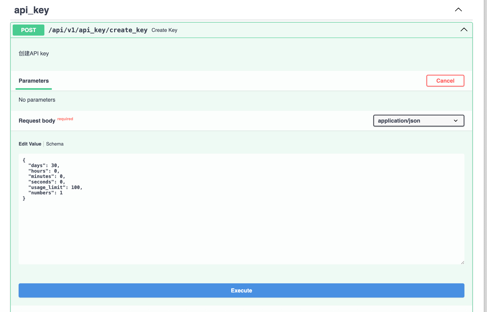
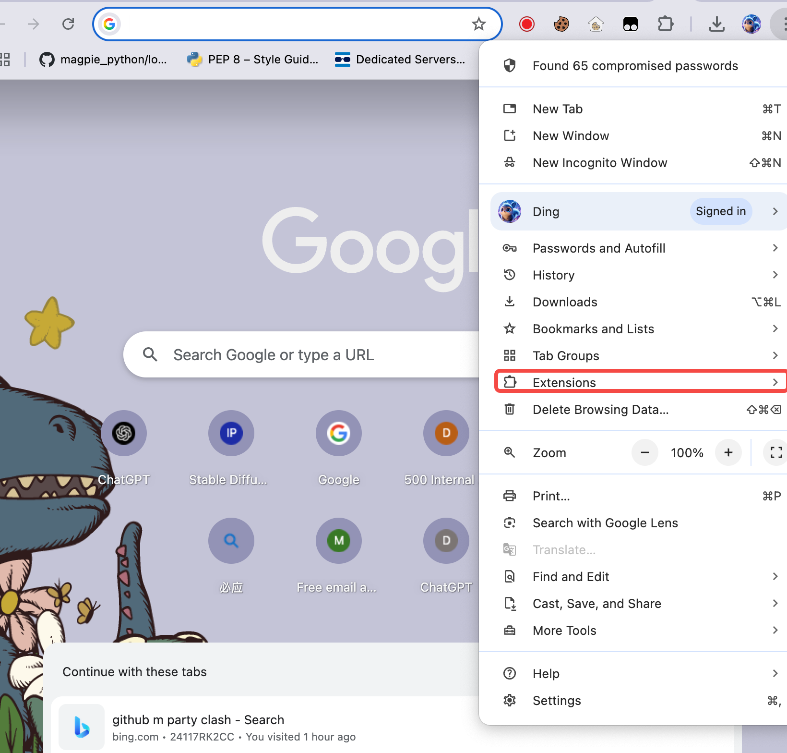
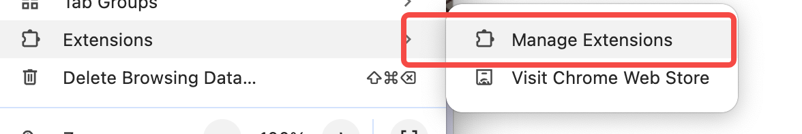
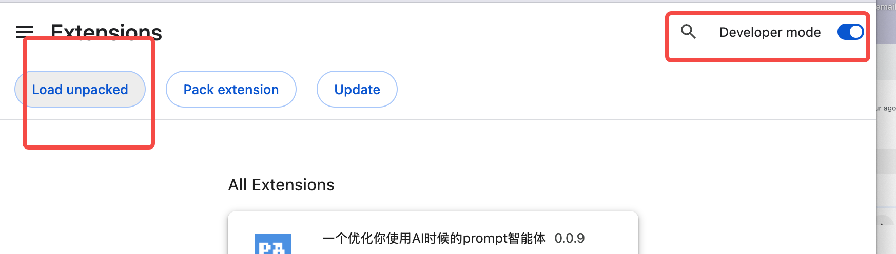
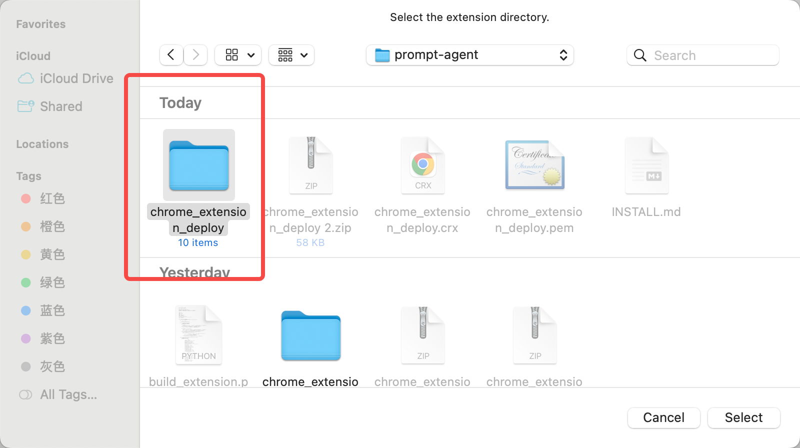
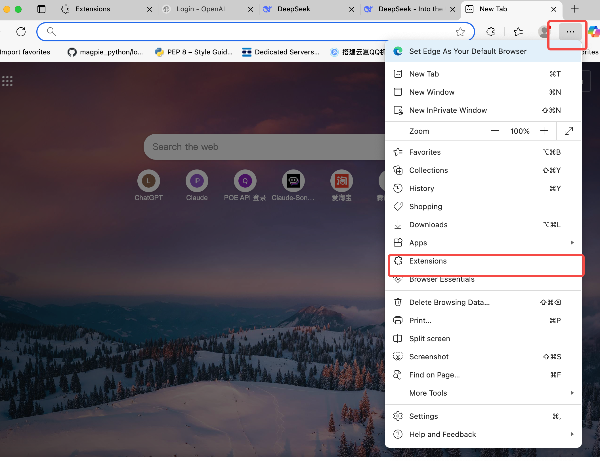
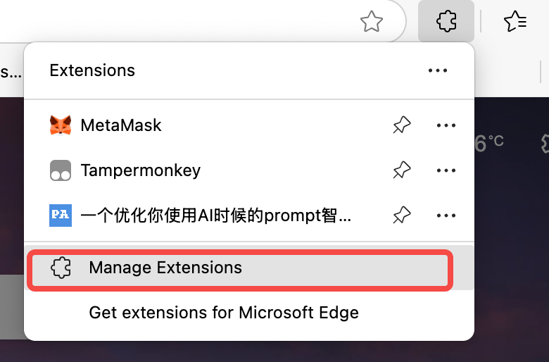
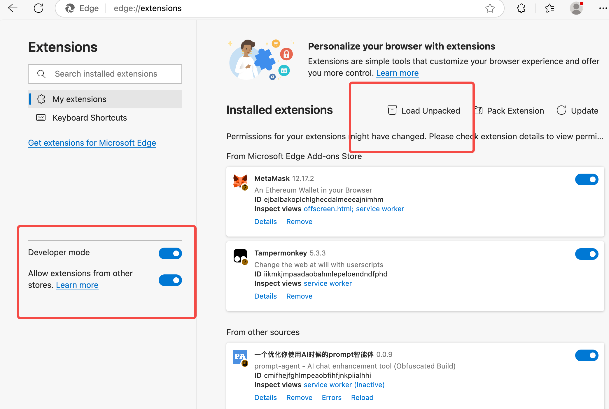

# Prompt Agent

[English](README.md) | 简体中文

Prompt Agent 是一个网页浏览器插件，帮助您在使用主流大语言模型（如 Claude、ChatGPT、DeepSeek 等）时丰富您的提示词（详见 `支持的大语言模型` 部分）。

## 演示视频

<video width="100%" controls>
  <source src="assets/Prompt-Agent-Demo.mp4" type="video/mp4">
  您的浏览器不支持视频标签。
</video>

观看 Prompt Agent 的实际操作！这个演示展示了浏览器扩展如何与各种大语言模型平台无缝集成，提升您的提示词体验。

## 安装

### 后端设置

1. **后端安装** - 我们推荐使用 `uv`：

```bash
uv pip install -e . --system
```

2. **配置 OpenAI 兼容 API**：

将 `.env.template` 文件复制为 `.env` 并填写环境变量：

```bash
BASE_URL=""
API_KEY=""
DEFAULT_MODEL=""  
```

3. **运行服务器**：

```bash
python main.py
```

服务器将在 `http://0.0.0.0:3648` 启动。

4. **生成 API 密钥**：

访问 `http://127.0.0.1:3648/docs` 并滚动到 API 密钥部分：



您将生成类似 `sk-xxxx` 的密钥。

### 前端设置

前端插件位于 `chrome_extension` 目录中，支持 Edge 和 Chrome 浏览器。

> 记住您之前生成的 API 密钥，您需要在扩展中粘贴它。

### 在 Chrome 中安装

1. **访问扩展管理**





2. **启用开发者模式并加载未打包的扩展**



3. **加载扩展文件**



### 在 Edge 中安装

1. **访问扩展管理**





2. **启用开发者模式并加载未打包的扩展**



3. **加载扩展文件**


## 功能特性

- **多语言模型支持**：适用于各种流行的大语言模型
- **浏览器扩展**：易于使用的 Chrome 和 Edge 扩展
- **API 集成**：用于后端通信的 RESTful API
- **提示词增强**：自动丰富您的提示词以获得更好的结果
- **自定义 RAG 支持**：使用检索增强生成构建您自己的知识库
- **向量数据库**：通过您的自定义提示词集合进行语义搜索

## 自定义 RAG 提示词数据库

Prompt Agent 支持自定义**检索增强生成（RAG）**功能，允许您构建和管理自己的提示词知识库：

- 🧠 **智能提示词检索**：从您的集合中自动找到相关提示词
- 📚 **自定义知识库**：导入和组织您自己的提示词库
- 🔍 **语义搜索**：高级向量相似度匹配
- ⚡ **实时集成**：无缝地将上下文注入到您的大语言模型对话中

### 支持的提示词来源

我们支持自定义 RAG 提示词参考，内置 Claude 提示词集合。**[了解更多 Claude RAG 集成 →](prompts_crawler/claude_lib/README.md)**

## 开始使用

1. 按照上述后端设置说明操作
2. 安装浏览器扩展
3. 在扩展中配置您的 API 密钥
4. 开始使用增强的提示词与您喜爱的大语言模型交互！

## 支持的大语言模型

| **AI 模型**         | **支持状态** | **说明**                    | **官方链接**                                        |
| ------------------- | ------------ | --------------------------- | --------------------------------------------------- |
| Claude              | ✅           | 完全支持                    | [Anthropic Claude](https://claude.ai/)             |
| Gemini              | ✅           | 完全支持                    | [Google Gemini](https://gemini.google.com/)        |
| ChatGPT             | ✅           | 完全支持                    | [OpenAI ChatGPT](https://chat.openai.com/)         |
| 混元 (Hunyuan)      | ✅           | 完全支持                    | [腾讯混元](https://hunyuan.tencent.com/)           |
| 元宝 (Yuanbao)      | ✅           | 完全支持                    | [字节跳动元宝](https://www.doubao.com/chat/yuanbao)|
| POE                 | ✅           | 完全支持                    | [POE](https://poe.com/)                            |
| DeepSeek            | ⚠️           | 部分支持 - 需要输入调整     | [DeepSeek](https://www.deepseek.com/)              |
| Grok                | ❌           | 暂不支持 - 需要输入调整     | [xAI Grok](https://grok.x.ai/)                     |
| 豆包 (Doubao)       | ❌           | 暂不支持 - 需要 CSQ         | [字节跳动豆包](https://www.doubao.com/)            |
| 通义千问 (Qwen)     | ❌           | 暂不支持 - 需要 CSQ         | [阿里巴巴通义千问](https://qwenlm.github.io/)      |
| 通义千问新版        | ❌           | 暂不支持 - 需要 CSQ         | [阿里巴巴通义](https://tongyi.aliyun.com/)         |
| Perplexity          | ❌           | 暂不支持 - 需要 CSQ         | [Perplexity AI](https://www.perplexity.ai/)        |

## 功能亮点

- **多语言模型支持**：适用于各种流行的大语言模型
- **浏览器扩展**：易于使用的 Chrome 和 Edge 扩展
- **API 集成**：用于后端通信的 RESTful API
- **提示词增强**：自动丰富您的提示词以获得更好的结果

## 贡献

我们欢迎贡献！请随时提交问题和拉取请求。

## 许可证

详见 [LICENSE](LICENSE) 文件。 