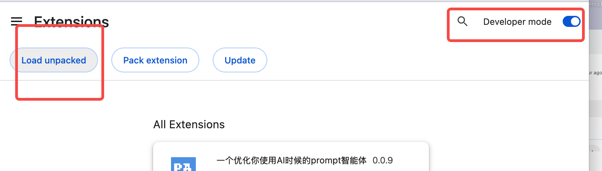
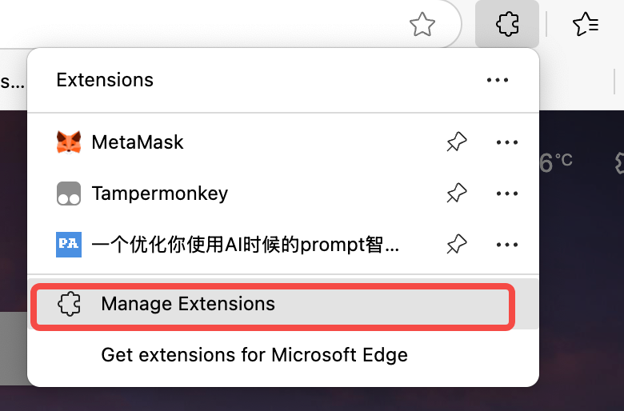

# Prompt Agent

English | [简体中文](README-zh.md)

Prompt Agent is a web browser plugin that helps you enrich your prompts when using mainstream LLMs such as Claude, ChatGPT, DeepSeek, and more (check the `Supported LLMs` section for details).

## Demo Video

<video width="100%" controls>
  <source src="assets/Prompt-Agent-Demo.mp4" type="video/mp4">
  Your browser does not support the video tag.
</video>

See Prompt Agent in action! This demo showcases how the browser extension seamlessly integrates with various LLM platforms to enhance your prompting experience.

## Installation

### Backend Setup

1. **Backend Installation** - We recommend using `uv`:

```bash
uv pip install -e . --system
```

2. **Configure OpenAI Compatible API**:

Copy the `.env.template` file to `.env` and fill in the environment variables:

```bash
BASE_URL=""
API_KEY=""
DEFAULT_MODEL=""  
```

3. **Run Server**:

```bash
python main.py
```

The server will start at `http://0.0.0.0:3648`.

4. **Generate API Key**:

Navigate to `http://127.0.0.1:3648/docs` and scroll to the API key section:


You will generate something like `sk-xxxx`.

### Frontend Setup

The frontend plugin is located in the `chrome_extension` directory, which supports both Edge and Chrome browsers.

> Remember the API key you generated previously, as you'll need to paste it in the extension.

### Installing in Chrome

1. **Access Extension Management**


2. **Enable Developer Mode and Load Unpacked Extension**



3. **Load the Extension Files**


### Installing in Edge

1. **Access Extension Management**




2. **Enable Developer Mode and Load Unpacked Extension**


3. **Load the Extension Files**


## Supported LLMs

| **AI Model**        | **Support Status** | **Notes**                           | **Official Link**                                   |
| ------------------- | ------------------ | ----------------------------------- | --------------------------------------------------- |
| Claude              | ✅                 | Fully supported                     | [Anthropic Claude](https://claude.ai/)             |
| Gemini              | ✅                 | Fully supported                     | [Google Gemini](https://gemini.google.com/)        |
| ChatGPT             | ✅                 | Fully supported                     | [OpenAI ChatGPT](https://chat.openai.com/)         |
| Hunyuan             | ✅                 | Fully supported                     | [Tencent Hunyuan](https://hunyuan.tencent.com/)    |
| Yuanbao             | ✅                 | Fully supported                     | [ByteDance Yuanbao](https://www.doubao.com/chat/yuanbao) |
| POE                 | ✅                 | Fully supported                     | [POE](https://poe.com/)                            |
| DeepSeek            | ⚠️                 | Partial support - input adjustment needed | [DeepSeek](https://www.deepseek.com/)              |
| Grok                | ❌                 | Not supported - input adjustment needed | [xAI Grok](https://grok.x.ai/)                     |
| Doubao              | ❌                 | Not supported - CSQ required        | [ByteDance Doubao](https://www.doubao.com/)        |
| Qwen (Tongyi)       | ❌                 | Not supported - CSQ required        | [Alibaba Qwen](https://qwenlm.github.io/)          |
| Tongyi Qianwen      | ❌                 | Not supported - CSQ required        | [Alibaba Tongyi](https://tongyi.aliyun.com/)       |
| Perplexity          | ❌                 | Not supported - CSQ required        | [Perplexity AI](https://www.perplexity.ai/)        |

## Features

- **Multi-LLM Support**: Works with various popular language models
- **Browser Extension**: Easy-to-use Chrome and Edge extension
- **API Integration**: RESTful API for backend communication
- **Prompt Enhancement**: Automatically enriches your prompts for better results
- **Custom RAG Support**: Build your own knowledge base with retrieval-augmented generation
- **Vector Database**: Semantic search through your custom prompt collections

## Custom RAG Prompt Database

Prompt Agent supports custom **Retrieval-Augmented Generation (RAG)** capabilities, allowing you to build and manage your own prompt knowledge base:

- 🧠 **Smart Prompt Retrieval**: Automatically find relevant prompts from your collection
- 📚 **Custom Knowledge Base**: Import and organize your own prompt libraries  
- 🔍 **Semantic Search**: Advanced vector-based similarity matching
- ⚡ **Real-time Integration**: Seamlessly inject context into your LLM conversations

### Supported Prompt Sources

We support custom RAG prompt reference with built-in Claude prompt collections. **[Learn more about Claude RAG integration →](prompts_crawler/claude_lib/README.md)**

## Getting Started

1. Follow the backend setup instructions above
2. Install the browser extension
3. Configure your API key in the extension
4. Start using enhanced prompts with your favorite LLM!

## Contributing

We welcome contributions! Please feel free to submit issues and pull requests.

## License

See the [LICENSE](LICENSE) file for details.
